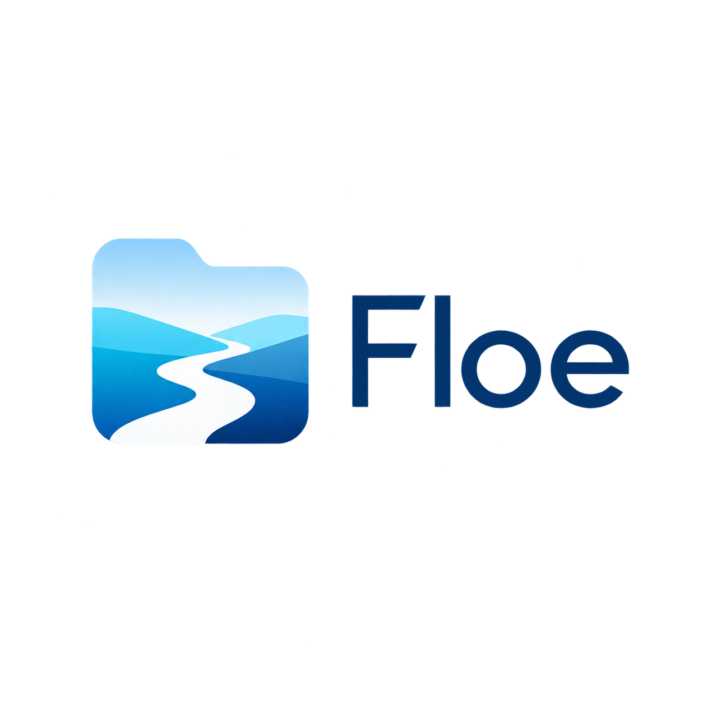

<div align="center">



<h3>A spatial file manager for Wayland</h3>

<p>
Fast, native Linux file management with flexible views, deep keyboard workflows,<br>
and a safety-first Rust core.
</p>

<p>
<a href="https://www.rust-lang.org/"></a>
<a href="https://www.gtk.org/"></a>
<a href="https://wayland.freedesktop.org/"></a>
<a href="./docs/ROADMAP.md"></a>
</p>

<p>
<a href="#what-floe-can-do">Features</a> ·
<a href="#build-and-run">Run Floe</a> ·
<a href="#keyboard-first-by-design">Keyboard</a> ·
<a href="#architecture">Architecture</a> ·
<a href="#project-status">Roadmap</a>
</p>

</div>

---

Floe is a modern Linux desktop file manager built in Rust with GTK4 and
libadwaita. It combines familiar daily file-management tools with spatial
navigation, highly configurable workflows, and a responsive application-owned
job engine.

It is Wayland-first, with Niri and KDE Plasma as first-class targets, while its
core browsing and file operations stay desktop-independent through standard
Linux APIs such as GIO, GLib, XDG, and freedesktop specifications.

> [!IMPORTANT]
> Floe is under active development and does not have a stable packaged release
> yet. It already has a substantial working feature set, but interfaces and
> stored preferences may still evolve.

## Why Floe?

- **Spatial when you want it.** Move between list, grid, split-pane, tabbed, and
  Miller-column workflows without giving up navigation state.
- **Fast where it matters.** Directory work, metadata, previews, thumbnails,
  hashing, archives, and file operations run away from GTK's main loop.
- **Built for Linux.** XDG folders, mounted devices, Trash, MIME associations,
  freedesktop thumbnailers, and native application launching are foundational.
- **Safe by design.** Original `PathBuf` values are preserved, shell
  interpolation is avoided, symlink behavior is explicit, and destructive
  operations require deliberate confirmation.
- **Yours to shape.** Appearance presets, view density, grid size, columns,
  shortcuts, sidebar sizing, and context-menu groups are configurable.

## What Floe can do

| Area | Current highlights |
| --- | --- |
| **Browse** | Virtualized list and grid views, adjustable grid size, sorting, grouping, optional metadata columns, hidden files, and large-folder-friendly loading |
| **Navigate** | Editable location bar, back/forward/parent history, tabs, restored sessions, split panes, and spatial Miller columns |
| **Select and organize** | Desktop-style multi-selection, drag and drop, copy, cut, paste, move, rename, duplicate, links, folders, empty files, FIFOs, and templates |
| **Trash and recovery** | Standards-compatible Trash browsing, restore, empty Trash, confirmed permanent deletion, conflict handling, and operation history |
| **Preview** | Space-bar Quick Preview for images, bounded text/code, PDF and office documents, audio/video, fonts, and archive listings |
| **Inspect** | Properties, folder totals, filesystem details, permissions and ownership editing, checksums, EXIF, and media metadata |
| **Archives** | Create and extract ZIP, tar, tar.gz, tar.xz, and reviewed 7z archives through bounded background jobs |
| **Work faster** | Current-folder Text/Glob/Regex filtering, streaming filename subtree search, searchable command palette, customizable shortcuts, optional Vim navigation, safe “Open Terminal Here,” batch rename, and customizable context menus |
| **Desktop integration** | XDG Places, bookmarks, drives and removable media, native mount prompts, GIO Open With/default apps, external clipboard files, and live file watching |
| **Appearance** | Native, Glass, Frosted, Minimal, and Compact presets; adjustable sidebar density and width; optional translucent floating surfaces |

Glass uses real top-level alpha composition, while Frosted uses a stronger
semantic-color tint over the same transparent window path. Actual background
blur remains compositor-dependent. Floe keeps both presets readable when blur
is unavailable and does not simulate expensive fake blur.

## Build and run

### Requirements

- Linux with a Wayland session
- Rust **1.85** or newer
- GTK **4.14** or newer
- libadwaita **1.5** or newer
- `pkg-config` / `pkgconf`

On Arch Linux and Arch-based distributions:

```bash
sudo pacman -S --needed rust gtk4 libadwaita pkgconf
```

Other distributions use different package names, often ending in `-dev` or
`-devel`. Confirm that the native libraries are visible before building:

```bash
pkg-config --modversion gtk4 libadwaita-1
```

### Run from source

```bash
git clone https://github.com/rodriguezcappsec/floe.git
cd floe
cargo run -p floe-app
```

Frosted is the current default appearance. While Floe is open, choose
**Appearance** from the three-dot header menu to switch between Native, Glass,
Frosted, Minimal, and Compact. The change is immediate and remembered for the
next launch.

To override the stored preset for one launch:

```bash
FLOE_APPEARANCE=glass cargo run -p floe-app
```

Accepted values are `native`, `glass`, `frosted`, `minimal`, and `compact`.
The environment value takes precedence for that launch without changing the
stored choice unless you select another preset in the application.

Close an existing Floe window before switching presets. Floe is single-instance,
so another launch otherwise reactivates the already-running appearance.

For more build, logging, smoke-test, and troubleshooting guidance, see
[Developing Floe](./docs/DEVELOPMENT.md).

## Keyboard-first by design

Floe keeps familiar desktop shortcuts while making its broader command surface
discoverable and customizable.

| Shortcut | Action |
| --- | --- |
| `Ctrl` + `Shift` + `P` | Open the command palette |
| `Ctrl` + `?` | Browse and customize keyboard shortcuts |
| `Ctrl` + `L` | Edit the current location |
| `Ctrl` + `T` / `Ctrl` + `W` | Open / close a tab |
| `Ctrl` + `C` / `Ctrl` + `X` / `Ctrl` + `V` | Copy / cut / paste |
| `F2` | Rename |
| `Delete` | Move to Trash |
| `Shift` + `Delete` | Delete permanently with confirmation |
| `Space` | Toggle Quick Preview |
| `Alt` + `Enter` | Open Properties |
| `Ctrl` + `1` / `Ctrl` + `2` | Switch to list / grid view |

Optional Vim-style browser navigation can be enabled without affecting text
fields, dialogs, or other native input controls.

## Architecture

Floe keeps GTK presentation separate from filesystem and job logic:

```text
GTK4 / libadwaita UI
          │
          ▼
Application commands and state
          │
          ▼
Bounded job managers and workers
          │
          ▼
GTK-independent filesystem core
```

The workspace currently contains:

```text
crates/
├── core/   Filesystem models, navigation, jobs, and path-safe operations
└── app/    GTK UI, application wiring, workers, and desktop integration
```

The core crate never depends on GTK. Potentially slow filesystem activity is
bounded and asynchronous, while results return to the GTK main thread for
presentation. Linux filenames are not assumed to be UTF-8, and displayed text
is never used to reconstruct an existing filesystem path.

Read the full [architecture guide](./docs/ARCHITECTURE.md) and
[privacy and security model](./docs/PRIVACY_SECURITY.md) for the invariants
behind these decisions.

## Supported desktops

| Environment | Direction |
| --- | --- |
| **Niri** | First-class target; spatial workflows complement Niri's horizontal navigation model |
| **KDE Plasma** | First-class target using standards before optional Plasma-specific integration |
| **Other Wayland desktops** | Generic support through GTK, GIO, XDG, portals, and freedesktop standards |

Specialized compositor integrations are isolated from the filesystem core and
must fail gracefully. The current application primarily uses the generic,
standards-based path.

## Project status

Floe has completed the foundation through **Phase 13C**, including archive,
productivity, command, preview, metadata, tab, split-view, Miller-column,
current-folder filtering, and bounded filename-search milestones. The next
bounded milestone is **Phase 13D — Content Search**.

Search is presented as one coherent workflow: `Ctrl+F` opens a shared surface
in **Quick Filter** mode, its visible selector switches to **Search Files**, and
`Ctrl+Shift+F` opens Search Files directly for keyboard-heavy workflows. The
shared optional Filters section combines type, extension, MIME, size, date,
owner, hidden, and Match Case controls; it remains memory-only and worker-owned.

The project tracks scope and verification explicitly:

- [Roadmap](./docs/ROADMAP.md) — ordered phases and exactly one recommended next milestone
- [Feature matrix](./docs/FEATURE_MATRIX.md) — capability and verification ledger
- [Design language](./DESIGN.md) — visual system and interaction rules
- [Privacy and security](./docs/PRIVACY_SECURITY.md) — threat model and prohibited claims
- [Privileged access](./docs/PRIVILEGED_ACCESS.md) — future administrator-scoped design

Features are marked complete only after their relevant formatting, build,
Clippy, automated test, and native Wayland gates pass.

## Contributing

Floe is still moving quickly. Before proposing a change, read:

1. [AGENTS.md](./AGENTS.md) for project invariants and scope discipline.
2. [Developing Floe](./docs/DEVELOPMENT.md) for dependencies and quality gates.
3. [Architecture](./docs/ARCHITECTURE.md) for crate ownership and async boundaries.
4. [Roadmap](./docs/ROADMAP.md) to avoid pulling future phases into a focused change.

The standard local quality gate is:

```bash
cargo fmt --all -- --check
cargo check --workspace
cargo clippy --workspace --all-targets -- -D warnings
cargo test --workspace
```

---

<div align="center">

<p><strong>Floe — a spatial file manager for Wayland.</strong></p>

<p>Built with Rust, GTK4, and a stubborn respect for your files.</p>

</div>
